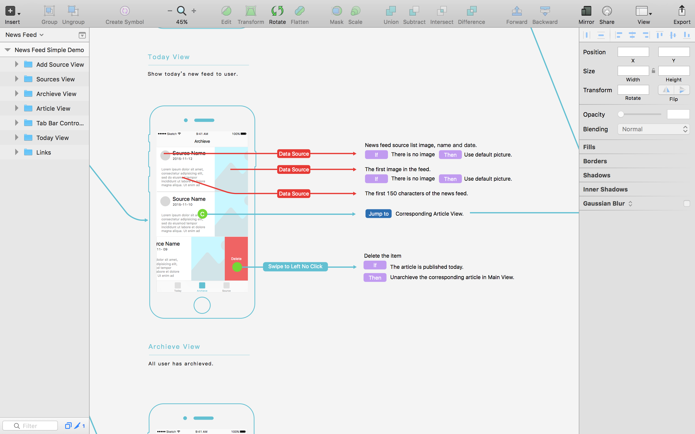

# wz_wireframe_kit.sketch

A kit to draw wireframes and note interaction details.

## What's this?

`wz_wireframe_kit.sketch` contains lots of elements you can use in your wireframes files.

I have seen and used lots of wireframe kits. Though they are all beautiful enough, they are not friendly to others. They have no explanations telling how the app works. So I designed `wz_wireframe_kit.sketch` and hope it could be friendly to designers, product managers and engineers, making wireframe a useful tool for communication.

It has:

**iPhone 6 Mockup**. Four kinds of iPhone 6 mockups. Important, Blank, With Navigation, With Tab Bar. To bring convenience to your work.

**Placeholders**. Image Placeholders, Avatar Placeholders - Circle and Rounded Rectangle.

**Buttons**. Primary Buttons, Tiny Button, Circle Buttons.

**Links**. Arrow, Link, Click and Link, Action, Link With Action, etc.

**Tag**. Minimum and Maximum, Different Status, Interaction Explanations, If and Then, etc.

## How to use?

Download `wz_wireframe_kit_1.1.sketch`, open it. Then copy, paste and edit! That's easy!

Use `iPhone Mockups` and `Interface Elements` to sketch interfaces . Use `Links` to demonstrate relations among the screens. And use `Tags` to write interaction guidelines for engineers.

Here is an example for your reference, a news feed app wireframe. It's not finished but enough to show how to use the wireframe kit.

## Update Records

### Version 1.1 February 19th, 2016

I used `wz_wireframekit.sketch` in my app *Today* and found something inconvenient. So I update it. It's now a little more beautiful-looking. :)

### Version 1.0 December 10th, 2016

## Appreciantion

The work is inspired by [Wireframe Kit for iPhone 6 Sketch Resource](http://www.sketchappsources.com/free-source/1091-wireframe-kit-iphone-6-sketch-freebie-resource.html). Many thanks to the designer [Barbara Giardelli](http://www.sketchappsources.com/contributor/bgiardelli).
